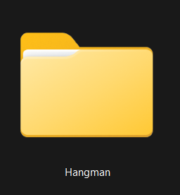
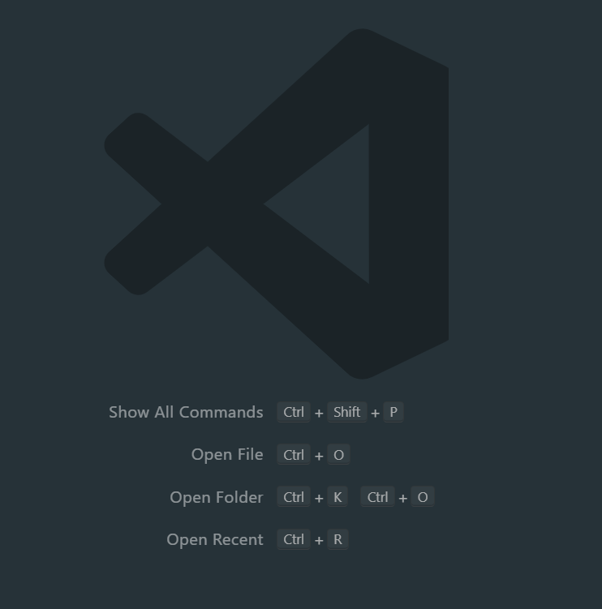

# <!--fit--> React

---
## React Hangman: Typescript

Lo primero que vamos a hacer es crear una carpeta en la que guardemos nuestros archivos llamada "Hangman"

---

## Instalacion de la Plantilla

Abrimos la carpeta que creamos en VS Code mediante el comando Control + k, Control + O. Esto nos abrira el explorador de archivos y seleccionamos la carpeta de HangMan.

---

## Instalacion de la plantilla

Ya que estemos dentro de la carpeta abrimos una terminal de VS Code mediante el comando Control + Ñ, en la terminal vamos a escribir "npm create vite"